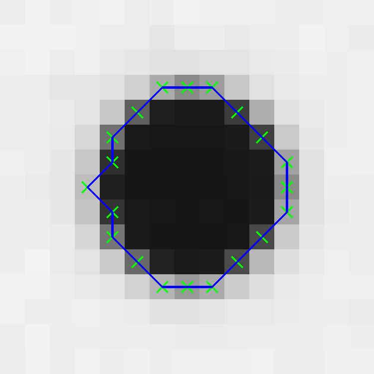

## Subpixel Edge Extraction with OpenCV

---

### Overview

OpenCV built in functionalities does not contain subpixel edge extraction methods. This repo demostrates how to implement one.

Some pixel precise edges extracted using the built-in `cv::canny` and `cv::findContours` operators are as illustrated below:  


 



<br>

<div style='text-align:center'> 
Pixel precise edge contours of circular marks.
</div>

<br>

The subpixel edge extraction implementation in this repo is based on the following two papers:

- C. Steger, "An unbiased detector of curvilinear structures", IEEE Transactions on Pattern Analysis and Machine Intelligence, 20(2): pp. 113-125, (1998)
- H. Farid and E. Simoncelli, "Differentiation of Discrete Multi-Dimensional Signals" IEEE Trans. Image Processing. 13(4): pp. 496-508 (2004)

Output results:


 


<br>

<div style='text-align:center'> 
Subpixel precise edge contours of circular marks.
</div>

### Dependencies

||Version|
|-|:-:|
|cmake | 3.21|
|OpenCV | 4.5.1|
|Eigen | 3.4|
|libtbb-dev | 2020.1-2|
|Boost | 1.78.0|
|fmt | 8.1.1|

### How to run

```bash
$ git clone https://github.com/raymondngiam/subpixel-edge-contour-in-opencv.git
$ cd subpixel-edge-contour-in-opencv
$ mkdir build && cd build
$ cmake ..
$ make
$ ./main
```

### Code Walkthrough

**Pixel-precise edge contour extraction**

A typical workflow for edge detection in OpenCV starts with the `cv::Canny` operator. 

The outcome of the `cv::Canny` operator is a binary edge image with non-maximum suppression algorithm applied. Thus, the edges are typically thinned to a single pixel width, where the edge magnitude response is maximum.

Line 51-58 in <a href='./main.cpp'>main.cpp</a>:

```cpp {.line-numbers}
cv::Mat image;
image = cv::imread(fmt::format("{}/{}",image_path,filename), cv::IMREAD_COLOR);
cv::Mat image_gray;
cv::cvtColor(image,image_gray,cv::COLOR_BGR2GRAY);

fmt::print("{},{}\n",image.rows,image.cols);
cv::Mat edgeIm = cv::Mat::zeros(image.rows,image.cols,CV_8UC1);
cv::Canny(image_gray,edgeIm,180,200);
```


<div style='text-align:center'> 
Left: Gray image. 
Right: Binary edge image.
</div>

<br>

Subsequently, we will apply `cv::findContours` operator to the binary edge image, in order to obtain a list of *boundary-traced* contours.

There is a slight complication when using the `cv::findContours` operator out-of-the-box with a *non-maximum suppressed* binary edge image. Any closed contour will return not one, but two outputs (one traced from the exterior, another traced from the interior, or hole).

Thus, we implement a custom method, `GetEdgeContourValidIndices` which takes in the `hierarchy` output from the `cv::findContours` operator (running in `RETR_CCOMP` mode), to filter the closed contours *traced from the exterior*.

Line 61-66 in <a href='./main.cpp'>main.cpp</a>:

```cpp {.line-numbers}
std::vector<std::vector<cv::Point>> contours;
std::vector<cv::Vec4i> hierarchy;
cv::findContours(edgeIm,contours,hierarchy,cv::RETR_CCOMP,cv::CHAIN_APPROX_NONE);
std::vector<int> validIndices;
std::vector<int> excludeIndices;
GetEdgeContourValidIndices(hierarchy, validIndices, excludeIndices);
```

The outcome of the `GetEdgeContourValidIndices` method is as visualized below:


 


<br>


 


<br>


<div style='text-align:center'> 
Left: Binary edge image. <br>
Center: Interiorly traced closed contours.<br>
Right: Exteriorly traced closed contours.
</div>

<br>

From visual inspection, we noticed that the interiorly traced closed contours are the more accuracte, and concise representation of the original binary edges.

The implementation of the `GetEdgeContourValidIndices` method (line 217-241 in <a href='./main.cpp'>main.cpp</a>) is actually pretty straightforward, as below:

```cpp {.line-numbers}
// For non maximum surpressed edge images, contour lines are single pixel in width.
// For closed contours, there are two possible outcomes from the boundary tracing algorithm,
// namely inner (hole), or external (non-hole) contour.
// OpenCV `findContours` with `RETR_CCOMP` option returns hierarchy list that starts with an external contour.
// Iterate through all external contours in the hierarchy list by following the `NEXT_SAME` indices;
// if the current external contour does have a child, this indicates that it is a false positive that
// corresponds to another inner hole contour in the set. Thus, we add it into the `excludeIndices` list.
void GetEdgeContourValidIndices(const std::vector<cv::Vec4i> &hierarchy, std::vector<int> &validIndices,
                                   std::vector<int> &excludeIndices) {
    const int NEXT_SAME = 0;
    const int PREV_SAME = 1;
    const int FIRST_CHILD = 2;
    const int PARENT = 3;

    int index=0;
    while (index != -1){
        if (hierarchy[index][NEXT_CHILD]!=-1){
            excludeIndices.emplace_back(index);
        }
        index = hierarchy[index][NEXT_SAME];
    }

    std::vector<int> l(hierarchy.size());
    std::iota(l.begin(),l.end(),0);
    std::set<int> setFullIndices(l.begin(),l.end());
    std::set_difference(setFullIndices.begin(),
                        setFullIndices.end(),
                        excludeIndices.begin(),
                        excludeIndices.end(),
                        std::back_inserter(validIndices)
                        );
}
```

After we have acquired the pixel-precise contour coordinates, we can move into the subpixel-precise edge point extraction.

**Subpixel-precise edge contour extraction**

The subpixel edge extraction function, `SubPixelEdgeContour` takes in the gray image, and a vector of pixel precise contours.

It then returns a vector of subpixel precise contours of double precision.

```cpp
void SubPixelEdgeContour(const cv::Mat &image_gray,
                         const std::vector<std::vector<cv::Point>> &filteredCont,
                         std::vector<std::shared_ptr<std::vector<std::shared_ptr<cv::Point2d>>>> &contSubPixFull);
```

Line 246-267 in `SubPixelEdgeContour`, <a href='./main.cpp'>main.cpp</a>.

```cpp {.line-numbers}
// 7-tap interpolant and 1st and 2nd derivative coefficients according to
// H. Farid and E. Simoncelli, "Differentiation of Discrete Multi-Dimensional Signals"
// IEEE Trans. Image Processing. 13(4): pp. 496-508 (2004)
std::vector<double> p_vec{0.004711,  0.069321,  0.245410,  0.361117,  0.245410,  0.069321,  0.004711};
std::vector<double> d1_vec{-0.018708,  -0.125376,  -0.193091,  0.000000, 0.193091, 0.125376, 0.018708};
std::vector<double> d2_vec{0.055336,  0.137778, -0.056554, -0.273118, -0.056554,  0.137778,  0.055336};

auto p = cv::Mat_<double>(p_vec);
auto d1 = cv::Mat_<double>(d1_vec);
auto d2 = cv::Mat_<double>(d2_vec);
cv::Mat dx, dy, grad;
cv::sepFilter2D(image_gray,dy,CV_64F,p,d1);
cv::sepFilter2D(image_gray,dx,CV_64F,d1,p);
cv::pow(dy.mul(dy,1.0) + dx.mul(dx,1.0),0.5,grad);

cv::Mat gy, gx, gyy, gxx, gxy;
cv::sepFilter2D(grad,gy,CV_64F,p,d1);
cv::sepFilter2D(grad,gx,CV_64F,d1,p);
cv::sepFilter2D(grad,gyy,CV_64F,p,d2);
cv::sepFilter2D(grad,gxx,CV_64F,d2,p);
cv::sepFilter2D(grad,gxy,CV_64F,d1,d1);
```

From the input gray image, its gradient amplitude image, `grad` is computed; and subsequently, the first and second order derivatives of the `grad` image are also computed.


Lastly, let's drill down to the core implementation details in the function `SubPixelFacet` (line 301-328 in <a href='./main.cpp'>main.cpp</a>) as shown below:

```cpp {.line-numbers}
// Subpixel edge extraction method according to
// C. Steger, "An unbiased detector of curvilinear structures",
// IEEE Transactions on Pattern Analysis and Machine Intelligence,
// 20(2): pp. 113-125, (1998)
std::shared_ptr<cv::Point2d> SubPixelFacet(const cv::Point& p,
                                           cv::Mat& gyMat,
                                           cv::Mat& gxMat,
                                           cv::Mat& gyyMat,
                                           cv::Mat& gxxMat,
                                           cv::Mat& gxyMat){
    auto row = p.y;
    auto col = p.x;
    auto gy = gyMat.at<double>(row,col);
    auto gx = gxMat.at<double>(row,col);
    auto gyy = gyyMat.at<double>(row,col);
    auto gxx = gxxMat.at<double>(row,col);
    auto gxy = gxyMat.at<double>(row,col);

    Eigen::Matrix<double,2,2>hessian;
    hessian << gyy,gxy,gxy,gxx;
    Eigen::JacobiSVD<Eigen::MatrixXd> svd(hessian, Eigen::ComputeFullV);
    auto v = svd.matrixV();
    // first column vector of v, corresponding to largest eigen value
    // is the direction perpendicular to the line
    auto ny = v(0,0);
    auto nx = v(1,0);
    auto t=-(gx*nx + gy*ny)/(gxx*nx*nx + 2*gxy*nx*ny + gyy*ny*ny);
    auto px=t*nx;
    auto py=t*ny;

    return std::make_shared<cv::Point2d>(col+px,row+py);
}
```

Let $r$ be the function value at point $(y_0,x_0)$ of the image where the Taylor series approximation took place; $r_x',r_y',r_{xx}'',r_{yy}'',r_{xy}''$ be the locally estimated first and second order derivatives at the point, that are obtained by convolution with derivative filters. Then the Taylor polynomial is given by

$p(y,x) = r + r_x'x + r_y'y + \frac{1}{2}r_x''x^2 + \frac{1}{2}r_y''y^2 + \frac{1}{2}r_{xy}''xy$

Curvilinear structures in 2D can be modeled as 1D line profile in the direction perpendicular to the line. Let this
direction be a unit vector $[n_y,n_x]^\text{T}$.

With the current pixel center as origin, any point along the direction perpendicular to the line, can be then defined as $[tn_y,tn_x]^\text{T}$, where $t\in \mathbb{R}$.

$p(tn_y,tn_x) = r + r_x'tn_x + r_y'tn_y + \frac{1}{2}r_x''t^2n_x^2 + \frac{1}{2}r_y''t^2n_y^2 + \frac{1}{2}r_{xy}''t^2n_xn_y$

Reframing the function $p$ to be parameterized by $t$ alone.

$p(t) = r + r_x'tn_x + r_y'tn_y + \frac{1}{2}r_x''t^2n_x^2 + \frac{1}{2}r_y''t^2n_y^2 + \frac{1}{2}r_{xy}''t^2n_xn_y$

We are interested to determine the value of $t$ whereby the function $p(t)$ is stationary.

Taking the derivative of $p(t)$ with respect to $t$,

$p'(t) = r_x'n_x + r_y'n_y + r_x''n_x^2t + r_y''n_y^2t + r_{xy}''n_xn_yt$

Setting $p'(t)=0$,

$0 = r_x'n_x + r_y'n_y + r_x''n_x^2t + r_y''n_y^2t + r_{xy}''n_xn_yt$

$r_x''n_x^2t + r_y''n_y^2t + r_{xy}''n_xn_yt = - r_x'n_x - r_y'n_y$

$t = \frac{- r_x'n_x - r_y'n_y}{r_x''n_x^2 + r_y''n_y^2 + r_{xy}''n_xn_y}$

The subpixel edge point where the gradient amplitude is maximum is thus given by,

$y = y_0 + tn_y$

$x = x_0 + tn_x$

**Visual explanation on determining the direction perpendicular to the line**


 

<br>

<div style='text-align:center'> 
Left: Gray image of a horizontal line. <br>
Right: Highlighted with red arrow is the direction perpendicular to the line.
</div>

<br>

<div style='text-align:center'>
 
</div>

<div style='text-align:center'> 
Zoomed in view of a particular pixel point (y<sub>0</sub>,x<sub>0</sub>) on the line in the gray image. The pixel of interest is marked with a red cross.
</div>

<br>


 
 
<br>

<div style='text-align:center'> 
Left: Second order derivative image along x direction, gxx. <br>
Center: Second order derivative image along y direction, gyy. <br>
Right: Second order derivative image along xy direction, gxy.
</div>

<br>

$g_{xx}(y_0,x_0) = -3.33786e^{-06}$

$g_{yy}(y_0,x_0) = -68.2977$

$g_{xy}(y_0,x_0) = 0.0$

The Hessian matrix, $\mathbf{H}$ is defined as:

$\mathbf{H} = \begin{bmatrix}g_{yy}(y_0,x_0) & g_{xy}(y_0,x_0) \\
g_{xy}(y_0,x_0) & g_{xx}(y_0,x_0)
\end{bmatrix}=\begin{bmatrix}-68.2977 & 0.0 \\
0.0 & -3.33786e^{-06}
\end{bmatrix}$

Computing SVD of the Hessian:

$\mathbf{H = USV^{\text{T}}}$

$\mathbf{U} = \begin{bmatrix}1.0 & 0.0 \\
0.0 & 1.0
\end{bmatrix}$

$\mathbf{S} = \begin{bmatrix}68.2977 & 0.0 \\
0.0 & 3.33786e^{-06}
\end{bmatrix}$

$\mathbf{V} = \begin{bmatrix}-1.0 & 0.0 \\
0.0 & -1.0
\end{bmatrix}$

First column vector of $\mathbf{V}$ corresponds to the maximum eigen value, which is equal to **the direction perpendicular to the line**.

$\mathbf{\hat{n}_{primary}} = \begin{bmatrix}-1.0 \\
0.0 
\end{bmatrix}$

<div style='text-align:center'>
 
</div>

<div style='text-align:center'> 
Zoomed in view of a particular pixel point (y<sub>0</sub>,x<sub>0</sub>) on the line in the gray image. Highlighted with red arrow is the direction of (n<sub>y</sub>,n<sub>x</sub>)<sup>T</sup>.
</div>

<br>

One way to think about this is that **for a horizontal line, the y axis second order derivative filter will have a maximum response, vice versa. Thus, principal axis with largest eigen value will be the one perpendicular to the line.**

### References

- C. Steger, "An unbiased detector of curvilinear structures", IEEE Transactions on Pattern Analysis and Machine Intelligence, 20(2): pp. 113-125, (1998)
- H. Farid and E. Simoncelli, "Differentiation of Discrete Multi-Dimensional Signals" IEEE Trans. Image Processing. 13(4): pp. 496-508 (2004)